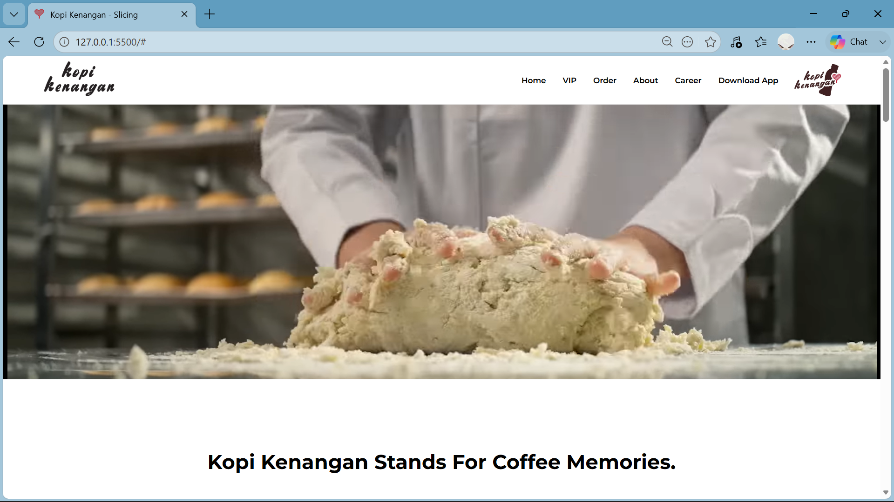
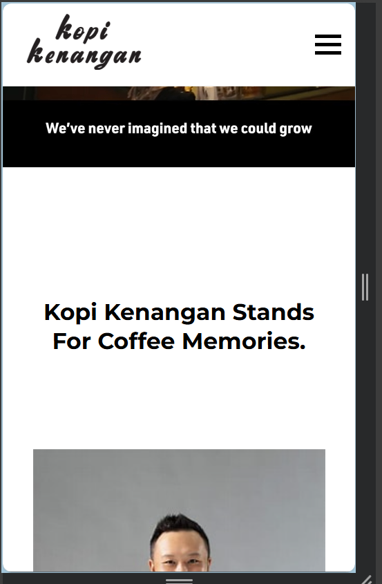
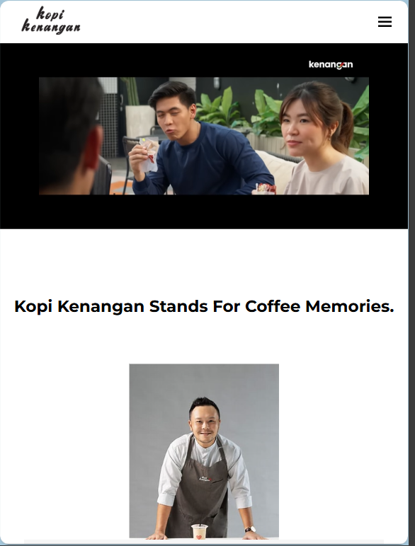

# Slicing Project: Kopi Kenangan Landing Page

Tugas Praktikum Pemrograman Web - Slicing Website menggunakan HTML, CSS, dan JavaScript.

## Deskripsi Proyek
Proyek ini adalah hasil *slicing* dari website **Kopi Kenangan**. Untuk mengimplementasikan struktur HTML yang semantik, styling menggunakan Plain CSS (tanpa framework), serta interaksi sederhana menggunakan JavaScript DOM.

## Fitur Utama
- **Responsive Design**: Tampilan yang optimal di berbagai perangkat (Mobile, Tablet, Desktop).
- **Plain CSS**: Seluruh styling dikerjakan menggunakan CSS murni (Flexbox & Grid).
- **JS DOM Interaction**: Implementasi *hamburger menu* untuk navigasi pada perangkat mobile.
- **Semantic HTML**: Penggunaan tag HTML5 yang terstruktur.

## Tech Stack
- **HTML5** (Structure)
- **CSS3** (Styling & Layout)
- **JavaScript** (DOM Manipulation)

## Screenshots
### Desktop View

### Mobile View

### Tab View

## Live Demo
[https://rismdgn.github.io/]

---

"YAY"
**Risma**
